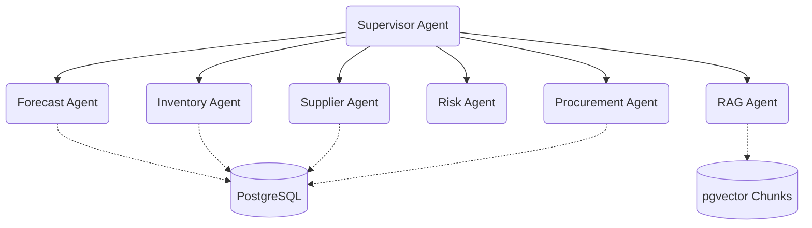

# Voice-Powered Agentic B2B Procurement System

A voice-compatible, multi-agent AI system designed to autonomously orchestrate B2B procurement workflows—including demand forecasting, best-quote supplier selection, reliability risk assessment, and purchase order drafting. Developed in Python and powered by Google Gemini models (`gemini-2.5-flash`, `text-embedding-004`) via LangGraph and SQLAlchemy.

---

## System Architecture



* **Supervisor Node**: Orchestrates task routing using Gemini structured instructions.
* **Forecast Agent**: Projects 30-day demand from transaction sales history or inventory thresholds.
* **Inventory Agent**: Checks real-time stock levels across warehouses relative to reorder thresholds.
* **Supplier Agent**: Queries quotes, catalog values, and lead times to calculate the cheapest purchase options.
* **Risk Agent**: Grades supplier reliability based on history, active alerts, and contract compliance.
* **RAG Agent**: Queries vector databases using pgvector to retrieve contract penalties, MOQs, and Escalations.
* **Procurement Agent**: Auto-approves orders under ₹25,000, stages pending POs, and handles inventory additions.

---

## Tech Stack
* **Framework**: LangGraph (Multi-Agent workflow coordination)
* **LLM Engine**: Google Gemini (via `langchain-google-genai` and `google-genai` SDK)
* **Backend API**: FastAPI + Uvicorn
* **Database**: PostgreSQL (v17/v18) with `pgvector` extension
* **DB Connection & Pooling**: SQLAlchemy Connection Pool

---

## Configuration & Environment Setup

Copy your environment variables into `.env` standard root structure:

```ini
GOOGLE_API_KEY="AIzaSyA..."
MODEL="gemini-2.5-flash"
EMBEDDING_MODEL="text-embedding-004"
TEMPERATURE=0.0

DB_HOST="localhost"
DB_PORT=5433
DB_NAME="procurement_ai"
DB_USER="postgres"
DB_PASSWORD="yourpassword"
```

1. **Install dependencies**:
   ```bash
   pip install -r requirements.txt
   ```

2. **Initialize & Seed the Database**:
   Runs the `schema.sql` (creating the 11-table structure) and populates initial items:
   ```bash
   python database/init_db.py
   ```

3. **Ingest RAG Documents**:
   Chunks, parses, and embeds PDF/text contracts inside `data/contracts/` to pgvector:
   ```bash
   python rag/ingest.py
   ```

---

## Running & Verifying the Project

### 1. Run Verification Flow
Verify both standard agent routing and semantic RAG search queries:
```bash
python verify_flow.py
```

### 2. Boot Backend Server
```bash
python api/main.py
```
* **API Endpoints**: 
  - `GET /api/status`: Health check verifying DB connection.
  - `GET /api/inventory`: Lists all warehouse items and threshold flags.
  - `GET /api/orders`: Retrieves full purchase order histories.
  - `GET /api/db-analytics`: Financial and counts breakdown analytics.
  - `POST /api/chat`: Interaction route triggering the multi-agent graph loop.